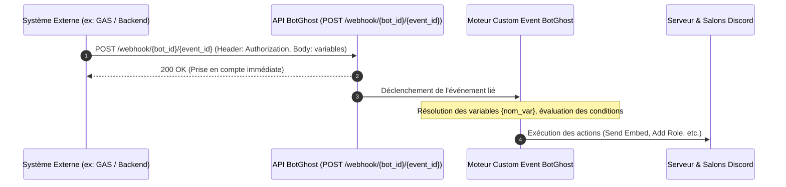
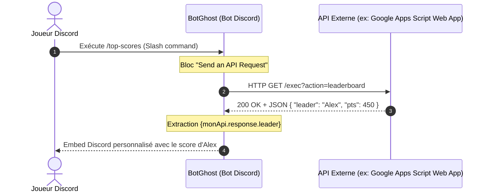

# Intégration BotGhost & Systèmes Externes : Spécifications et Architecture

Ce document synthétise les mécanismes d'interconnexion entre un bot Discord hébergé sur **BotGhost** et des systèmes ou backends tiers (ex. Google Apps Script, API REST, Make, Zapier, IFTTT).

---

## 1. Synthèse des Méthodes d'Intégration Disponibles

| Méthode | Direction du flux | Protocole & Transport | Déclencheur (Trigger) | Cas d'usage types |
| :--- | :--- | :--- | :--- | :--- |
| **Webhooks Entrants (API BotGhost)** | **Externe ➔ BotGhost** | HTTP POST (`application/json`) | Événement système externe (cron, mutation en base, script Google Apps Script) | Notification de scores, alertes de build, annonces automatiques avec logique du bot (embed, rôles, conditions). |
| **Actions Sortantes ("Send an API Request")** | **BotGhost ➔ Externe** | HTTP REST (`GET`, `POST`, `PUT`, `PATCH`, `DELETE`) | Interaction Discord (commande slash, bouton, menu, message, réaction) | Interrogation d'une API de classement, écriture dans Google Sheets via Web App GAS, validation d'un code. |
| **Intégration Native IFTTT** | **Bidirectionnelle** | Webhook applicatif managé (OAuth) | **Sortant** : Bloc "Execute an IFTTT Trigger"<br>**Entrant** : Trigger IFTTT vers Action "Trigger a Custom Event" | Connexion no-code vers 700+ services (Twitter, Twitch, Dropbox, Google Drive, flux RSS). |
| **Ponts Automatisation (Zapier / Make)** | **Bidirectionnelle** | HTTP Webhooks REST | Webhooks entrants BotGhost ou bloc sortant "Send an API Request" | Synchronisation CRM, formulaires Notion/Airtable, pipelines d'automatisation avancés. |

---

## 2. Webhooks Entrants (API BotGhost & Custom Events)

### 2.1 Fonctionnement & Architecture
Contrairement aux webhooks Discord standards qui ne font que poster un message passif dans un salon, le **Webhook Entrant BotGhost** déclenche un **Custom Event** complet. Le bot exécute alors une séquence logique : envoi d'embeds, conditions `if/else`, attribution de rôles, calculs ou messages privés (DM).



### 2.2 Endpoint & En-têtes HTTP

- **Endpoint officiel** :
  ```http
  POST https://api.botghost.com/webhook/{bot_id}/{event_id}
  ```
  - `{bot_id}` : Identifiant unique de votre application/bot BotGhost.
  - `{event_id}` : Identifiant alphanumérique généré lors de la création du webhook dans le module *Webhooks*.
- **En-têtes HTTP obligatoires** :
  ```http
  Content-Type: application/json
  Authorization: <API_KEY_BOTGHOST>
  ```
  *(La clé API est générée et consultable dans le module Webhooks de votre dashboard BotGhost).*

### 2.3 Format Obligatoire du Payload JSON

BotGhost impose une structure stricte sous forme de tableau d'objets `variables`. **Chaque variable doit impérativement être encapsulée entre accolades `{` et `}` dans le champ `variable`**, sans quoi l'API renvoie une erreur `400 Bad Request`.

```json
{
  "variables": [
    {
      "name": "Nom du Joueur",
      "variable": "{player_name}",
      "value": "Alexandre"
    },
    {
      "name": "Points Ajoutés",
      "variable": "{points_added}",
      "value": "150"
    },
    {
      "name": "Catégorie",
      "variable": "{category}",
      "value": "Mario Kart"
    },
    {
      "name": "Identifiant Discord",
      "variable": "{discord_user_id}",
      "value": "223344556677889900"
    }
  ]
}
```

| Propriété | Type | Description / Règle de validation |
| :--- | :--- | :--- |
| `name` | String | Libellé descriptif affiché dans l'interface BotGhost. |
| `variable` | String | **Strict** : Doit impérativement commencer par `{` et se terminer par `}` (ex: `{pts}`, `{player}`). |
| `value` | String / Number | Valeur injectée qui remplacera la variable lors de l'exécution de l'événement. |

### 2.4 Configuration dans le Dashboard BotGhost

1. **Créer le Webhook** :
   - Ouvrir le module **Webhooks** sur le dashboard.
   - Cliquer sur **Add Webhook Event**, renseigner un nom descriptif.
   - Copier l'**API Key** et l'**Event ID** (ou l'URL complète générée).
2. **Créer le Custom Event** :
   - Se rendre dans le module **Custom Events** ➔ **Create Event**.
   - Définir le déclencheur (**Trigger**) sur **Webhook**.
   - Sélectionner le webhook créé précédemment.
   - Renseigner le **Server ID (Guild ID)** : permet à BotGhost de résoudre la liste des salons, des rôles et des membres Discord.
3. **Construire la chaîne d'actions** :
   - Ajouter un bloc **Send Message** ou **Send Embed**.
   - Utiliser les variables déclarées dans votre payload : `{player_name}`, `{points_added}`, etc.
   - Possibilité de mentionner un utilisateur dynamiquement : `<@{discord_user_id}>`.
   - Ajouter des blocs conditionnels : si `{points_added} >= 100`, assigner un rôle ou déclencher un GIF.

---

## 3. Actions Sortantes ("Send an API Request")

### 3.1 Fonctionnement
BotGhost intègre nativement un bloc d'action **"Send an API Request"** (sous la catégorie *API Actions* du constructeur visuel). Il permet au bot d'interroger un serveur externe synchrone en réponse à une action Discord (ex: commande slash `/score`, clic sur un bouton).



### 3.2 Spécifications Techniques du Bloc de Requête

| Composant | Paramètres configurables | Détails & Capacités |
| :--- | :--- | :--- |
| **Nom de l'Action** | Identifiant unique (ex: `statsApi`) | Définit le préfixe de la variable de réponse. |
| **Méthodes HTTP** | `GET`, `POST`, `PUT`, `PATCH`, `DELETE` | Supporte l'ensemble des verbes REST standards. |
| **URL & Paramètres** | URL cible + Query Params | Supporte les variables BotGhost dans l'URL et les paramètres (ex: `?user={user.id}`). |
| **En-têtes (Headers)** | Clé / Valeur dynamiques | `Authorization`, `Content-Type`, etc. Macro spéciale **`{TOKEN_SECRET}`** pour appeler directement l'API Discord sans exposer le token. |
| **Corps (Request Body)** | Formulaire clé/valeur OU **Raw JSON Body** | Permet de forger des payloads JSON complexes avec injection de variables dynamiques. |
| **Options d'exécution** | - *Automatically exclude empty fields*<br>- *Replace variables in Body/Headers/URL*<br>- *Sanitize response data* | Nettoyage des champs nuls et sécurisation anti-injection de variables. |

### 3.3 Exploitation des Données de Réponse (Response Handling)
BotGhost parse automatiquement le JSON retourné par l'API externe et l'expose via la notation pointée :

- **`{nomAction.response.<propriété>}`** : Accès direct à une valeur du JSON de réponse.
  - Exemple : Si l'API retourne `{"player": "Alex", "rank": 1}`, la variable `{statsApi.response.player}` renvoie `"Alex"`.
- **`{nomAction.status}`** : Code de statut HTTP numérique (ex: `200`, `404`, `500`).
- **`{nomAction.statusText}`** : Message de statut HTTP (ex: `"OK"`, `"Not Found"`).

> **Outil de test intégré** : Le dashboard BotGhost inclut un bouton **Test Request** qui simule l'appel, affiche la réponse réelle et permet de cliquer sur n'importe quel champ pour copier directement la balise de variable correspondante.

---

## 4. Intégrations Tierces & Outils d'Automatisation (IFTTT, Zapier, Make)

### 4.1 Intégration Native IFTTT
BotGhost dispose d'une intégration OAuth directe certifiée avec **IFTTT** ([ifttt.com/botghost](https://ifttt.com/botghost)).

1. **BotGhost ➔ IFTTT (Sortant)** :
   - Bloc d'action : **"Execute an IFTTT Trigger"**.
   - Paramètre : `Action ID` (défini à l'identique dans l'Applet IFTTT).
   - Variables : **10 slots de variables** (`Variable 1` à `Variable 10`), utilisables comme ingrédients dans IFTTT (pour alimenter Google Sheets, envoyer un tweet, déclencher un webhook, etc.).
2. **IFTTT ➔ BotGhost (Entrant)** :
   - Trigger IFTTT (ex: nouvel email, nouveau post Reddit, événement calendrier).
   - Action IFTTT : **"BotGhost: Trigger a Custom Event"**.
   - Paramètres : Sélection du Bot, renseignement de l'`Event ID` et du `Discord Server ID`.
   - Variables : Jusqu'à 10 variables transmises, accessibles dans BotGhost sous `{ifttt_variable1}` à `{ifttt_variable10}`.

### 4.2 Intégration Zapier & Make (ex-Integromat)
Il n'existe pas d'application dédiée "BotGhost" sur le catalogue officiel Zapier/Make, mais l'intégration s'effectue sans aucune restriction via les modules Webhooks standards :

- **Zapier/Make ➔ BotGhost** :
  - Module *Webhooks by Zapier* (Custom Request) ou module *HTTP Make*.
  - Méthode `POST` vers `https://api.botghost.com/webhook/{bot_id}/{event_id}`.
  - Headers `Authorization: <API_KEY>` et payload JSON formaté avec le tableau `variables`.
- **BotGhost ➔ Zapier/Make** :
  - Créer un webhook *Catch Hook* dans Zapier ou Make.
  - Dans BotGhost, ajouter un bloc **Send an API Request** ciblant l'URL du Catch Hook en `POST` avec un corps JSON.

---

## 5. Contraintes Techniques, Limites et Abonnements

### 5.1 Répertoire des Identifiants Requis

| Identifiant | Rôle | Emplacement dans BotGhost |
| :--- | :--- | :--- |
| **`bot_id`** | Identifie l'application BotGhost / Discord. | URL du dashboard (`/dashboard/<bot_id>/...`) ou *Settings ➔ General*. |
| **`event_id`** | Identifie le déclencheur d'événement webhook ou IFTTT. | Généré automatiquement dans le module *Webhooks* lors de l'ajout d'un webhook. |
| **`server_id`** *(Guild ID)* | Contextualise l'événement sur un serveur Discord. | Spécifié dans la configuration du Custom Event (*Discord Server ID*). |
| **`API Key`** | Token d'authentification pour les webhooks entrants. | Consultable et régénérable dans le module *Webhooks*. |

### 5.2 Tableau Comparatif des Plans (Free vs Premium)

| Fonctionnalité | Plan Gratuit (Free) | Plan Premium (Pro / Lifetime) |
| :--- | :---: | :---: |
| **Module Webhooks (Entrants)** | ✅ Inclus | ✅ Inclus |
| **Module IFTTT** | ✅ Inclus | ✅ Inclus |
| **Bloc "Send an API Request" (Sortant)** | ✅ Inclus | ✅ Inclus |
| **Nombre de Custom Events** | **Limité à 3 événements** | **Illimité** |
| **Nombre de Custom Commands** | **Limité à 3 commandes** | **Illimité** |
| **Data Storage (Variables persistantes)** | Limité à 500 appels / mois | Illimité |
| **Nombre de serveurs Discord** | Jusqu'à 5 serveurs | Illimité |
| **Branding "Made with BotGhost"** | Obligatoire | Supprimable |

### 5.3 Limitations Techniques et Gestion des Erreurs

- **Délai d'interaction Discord (3 secondes)** : Lors d'une commande slash sortante appelant une API externe, l'API externe doit répondre en moins de 3 secondes pour éviter un échec de l'interaction Discord.
- **Redirections HTTP (Google Apps Script Web App 302)** :
  - Les déploiements GAS Web App (`/exec`) répondent par une redirection HTTP 302 vers `script.googleusercontent.com`.
  - Le bloc "Send an API Request" de BotGhost gère les redirections GET standards, mais pour les écritures en POST, il est recommandé de vérifier la compatibilité ou d'utiliser un middleware léger (Cloudflare Worker) si la redirection POST n'est pas suivie.

#### Codes d'erreur de l'API Webhook Entrante :
- **`200 OK`** : Événement transmis avec succès au bot.
- **`400 Bad Request`** : Tableau `variables` manquant ou champ `variable` ne respectant pas le format `{nom}`.
- **`401 Unauthorized`** : Clé API manquante ou erronée dans l'en-tête `Authorization`.
- **`404 Not Found`** : `bot_id` ou `event_id` inexistant ou événement supprimé.
- **`405 Method Not Allowed`** : Méthode HTTP différente de `POST`.
- **`429 Too Many Requests`** : Dépassement de la limite de fréquence (environ 60 requêtes/minute).

---

## 6. Exemples Concrets d'Implémentation

### 6.1 Requête HTTP POST via cURL

```bash
curl -X POST "https://api.botghost.com/webhook/123456789012345678/evt_abc123xyz" \
  -H "Content-Type: application/json" \
  -H "Authorization: bg_sec_998877665544332211" \
  -d '{
    "variables": [
      {
        "name": "Joueur",
        "variable": "{player}",
        "value": "Alice"
      },
      {
        "name": "Points",
        "variable": "{pts}",
        "value": "250"
      },
      {
        "name": "Top",
        "variable": "{top_name}",
        "value": "Tournoi Belote"
      }
    ]
  }'
```

---

### 6.2 Déclencheur depuis Google Apps Script (`UrlFetchApp`)

Exemple d'intégration utilisable dans un projet Google Apps Script (ex: synchronisation de scores depuis `StorageService` ou `AutoPoints.gs` vers Discord via BotGhost) :

```javascript
/**
 * Notifie un événement de score vers un bot Discord via l'API Webhook BotGhost.
 * 
 * @param {string} player Nom du joueur
 * @param {number} points Nombre de points attribués
 * @param {string} category Nom du Top / Catégorie
 */
function notifyBotGhostScore(player, points, category) {
  const BOT_ID = "123456789012345678";
  const EVENT_ID = "evt_score_notification";
  const API_KEY = PropertiesService.getScriptProperties().getProperty("BOTGHOST_API_KEY");

  const url = "https://api.botghost.com/webhook/" + BOT_ID + "/" + EVENT_ID;

  const payload = {
    variables: [
      {
        name: "Joueur",
        variable: "{player}",
        value: String(player)
      },
      {
        name: "Points",
        variable: "{pts}",
        value: String(points)
      },
      {
        name: "Catégorie",
        variable: "{category}",
        value: String(category)
      },
      {
        name: "Horodatage",
        variable: "{timestamp}",
        value: Utilities.formatDate(new Date(), "Europe/Paris", "dd/MM/yyyy HH:mm")
      }
    ]
  };

  const options = {
    method: "post",
    contentType: "application/json",
    headers: {
      "Authorization": API_KEY
    },
    payload: JSON.stringify(payload),
    muteHttpExceptions: true
  };

  try {
    const response = UrlFetchApp.fetch(url, options);
    const statusCode = response.getResponseCode();
    if (statusCode === 200) {
      Logger.log("Succès notification BotGhost [200]");
    } else {
      Logger.log("Erreur BotGhost [" + statusCode + "] : " + response.getContentText());
    }
  } catch (err) {
    Logger.log("Exception réseau BotGhost : " + err.toString());
  }
}
```

---

## 7. Tableau Comparatif Synthétique

| Critère | Webhooks Entrants | Send an API Request | IFTTT (Intégration native) | Zapier / Make (via Webhook) |
| :--- | :--- | :--- | :--- | :--- |
| **Sens de la communication** | Externe ➔ Discord | Discord ➔ Externe | Bidirectionnel | Bidirectionnel |
| **Authentification** | Clé API BotGhost (`Authorization`) | Définie par l'API externe (Bearer, Basic, etc.) | OAuth2 managé (compte lié) | Clé API BotGhost ou Webhook Secret |
| **Format des données** | JSON strict (`variables: [{name, variable, value}]`) | Libre (`GET params`, `JSON body`, form-data) | 10 slots d'ingrédients / variables | JSON libre côté Zapier / Format BotGhost côté entrant |
| **Traitement de la réponse** | Code statut HTTP (`200 OK`) | Extraction fine par notation pointée (`{req.response.prop}`) | Asynchrone / opaque | Dépend du sens du webhook |
| **Disponibilité Plan Free** | ✅ Oui (plafonné à 3 Custom Events) | ✅ Oui (plafonné à 3 Custom Commands) | ✅ Oui | ✅ Oui (limité par les quotas de webhooks/events) |
| **Cas d'usage idéal** | Alertes externes, notifications GAS/CI vers Discord | Commandes slash interactives interrogeant une base externe | Connexion rapide à des services SaaS grand public | Automatisation complexe multi-étapes et synchronisation DB |
